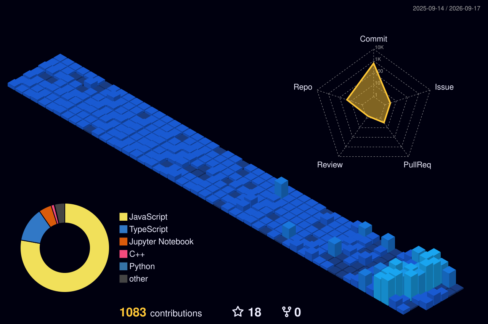

# Shaurya Chaudhary
### Math & Computing @ DTU · Backend & Systems

 

### ⚡ Quick hits
- 🎓 Math & Computing @ DTU
- 🌀 Shipped **Agamotto** — AI surveillance platform
- 📈 Building **Arb** — real-time arbitrage tracker for Indian markets
- 🛠️ Stack: React/Next.js · FastAPI · PostgreSQL · Redis · Docker · K8s

 

  

 

  
  

 

### 🌐 3D Contribution Graph

  

<i>Shipping things people actually use — one late night at a time.</i>

